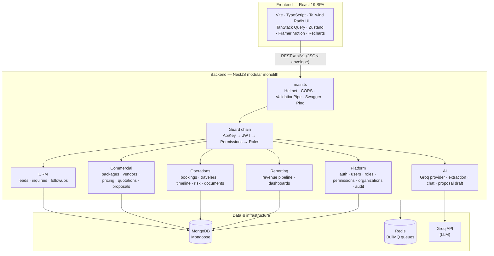
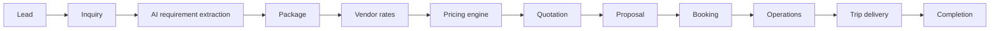

# DMC CRM Platform

> **Product brand:** EasyGoVenture · **Codebase:** `dmc-crm`

A purpose-built **CRM for Travel Destination Management Companies (DMCs)** — the B2B
wholesalers who arrange visas, hotels, transfers, tours, and holiday packages for travel
agencies. It replaces the manual, WhatsApp-driven sales workflow with a single system that
carries a deal from first message all the way to trip delivery.

Built as a **modular monolith** (NestJS + MongoDB) with a React 19 SPA, an AI assistant
layer (Groq), a deterministic pricing engine, and a full travel-operations engine.

---

## Table of contents

1. [Why it exists](#why-it-exists)
2. [Core features](#core-features)
3. [Architecture](#architecture)
4. [End-to-end workflow](#end-to-end-workflow)
5. [AI workflow](#ai-workflow)
6. [Security](#security)
7. [Operations engine](#operations-engine)
8. [Tech stack](#tech-stack)
9. [Repository layout](#repository-layout)
10. [Getting started](#getting-started)
11. [Environment variables](#environment-variables)
12. [Scripts](#scripts)
13. [API contract](#api-contract)
14. [Demo journey](#demo-journey)
15. [Project status & roadmap](#project-status--roadmap)
16. [Conventions](#conventions)
17. [License](#license)

---

## Why it exists

A DMC sales agent today juggles the whole deal by hand over WhatsApp:

```text
Customer WhatsApp message
   → Agent collects requirements
   → Agent finds hotels
   → Agent calculates pricing
   → Agent prepares a quotation
   → Agent sends a proposal
   → Customer accepts
   → Operations execute the trip
```

Requirements live in chat threads, pricing lives in spreadsheets, and nothing is tracked
once the trip starts. **DMC CRM turns that ad-hoc flow into a structured pipeline** with an
audit trail, AI-assisted data capture, repeatable pricing, and an operations board — so the
same agent handles more deals with fewer mistakes.

**Who uses it**

| Role | What they do in the platform |
| --- | --- |
| Sales agent | Capture leads, run AI extraction, build packages, send proposals |
| Operations team | Manage bookings, travelers, timelines, documents, and risk |
| Organization owner / admin | Manage users, roles, vendors, and org settings |
| Super admin | Cross-tenant administration |

---

## Core features

### CRM
- **Leads** — capture, status pipeline, soft-delete (related proposals, follow-ups, and
  activities are preserved).
- **Follow-ups** — scheduled next actions against a lead.
- **Inquiry management** — structured trip requirements linked to a lead.

### Commercial engine
- **Packages** — internal costing workspace (destination, dates, travelers).
- **Package items** — line items that make up a package.
- **Vendor rates** — vendor catalog and per-service rate cards.
- **Pricing engine** — deterministic cost → markup → sell-price → expected-profit totals
  (`pricing-engine.service.ts`); packages never carry hand-typed totals.
- **Quotations** — numbered quotations converted from priced packages.
- **Proposal conversion** — customer-facing proposals generated from quotations, with a
  shareable proposal token.

### Operations engine
- **Travelers** — traveler roster per booking (1–100, validated).
- **Bookings** — booking lifecycle from confirmed proposal onward.
- **Hotel / transfer / visa operations** — per-service operational tracking.
- **Travel timeline** — generated day-by-day trip timeline.
- **Risk engine** — operational risk scoring for a trip.
- **Documents** — generated operational documents.
- **Operations dashboard** — live operational metrics and context.

### AI (Groq-backed)
- **AI chat assistant** — itineraries, visa questions, quotation drafting, customer
  communication.
- **AI inquiry extraction** — turns a pasted WhatsApp/email/free-text enquiry into
  structured fields and pre-fills lead creation.
- **AI proposal drafting** — customer-facing Markdown proposals grounded in the real hotel
  catalog.
- **AI assist endpoints** — follow-up suggestions, proposal summaries, next-best-action.

### Dashboard & reporting
- **Pipeline** — lead/deal pipeline overview.
- **Revenue** — expected revenue, expected profit, and pipeline revenue
  (`revenue-pipeline.service.ts`).
- **Operations metrics** — operational dashboard for in-flight trips.

> **Currency:** all monetary values are displayed in **USD ($)**. Amounts stored in another
> currency (e.g. legacy AED, INR vendor rates) are converted to USD on display.

---

## Architecture



- **Modular monolith:** one deployable NestJS app; each domain is an isolated module with a
  clean seam toward future service extraction.
- **Global guard chain (AND-ed):** perimeter `x-api-key` (optional) → JWT bearer →
  permission checks → role checks. Routes opt out with `@Public()`.
- **Queues:** BullMQ on Redis for notifications / reports / follow-ups.

See [docs/ARCHITECTURE.md](docs/ARCHITECTURE.md) and [docs/CONVENTIONS.md](docs/CONVENTIONS.md).

---

## End-to-end workflow



Each stage is a real module: `leads → inquiries → ai → packages → vendors →
pricing-engine → quotations → proposals → operations(bookings/travelers/timeline)`.

---

## AI workflow

AI is a Groq-backed provider layer. **If `GROQ_API_KEY` is unset, AI endpoints are disabled**
and the rest of the platform runs normally.

### AI chat
Assists agents with:
- itineraries and destination questions
- visa process questions (never claims guaranteed approval)
- quotation drafting and customer communication

### AI inquiry extraction
Converts an unstructured enquiry:

```text
WhatsApp message  ·  Email  ·  Free text
```

into structured fields, then pre-fills **Lead Creation**:

```text
Customer name · Phone · Email · Destination · Budget
Travel date  · Travelers · Service type  (+ confidence & missing-field flags)
```

### AI endpoints (backend)

| Endpoint (`POST /api/v1/ai/...`) | Purpose |
| --- | --- |
| `parse-inquiry` | Extract structured fields from raw enquiry text |
| `chat` | Conversational assistant (Markdown) |
| `proposal-draft` | Draft a customer-facing proposal grounded in the hotel catalog |
| `proposal-summary` | Summarize a proposal |
| `followup-suggestion` | Suggest the next follow-up |
| `next-action` | Recommend the next-best action on a lead |

---

## Security

- **JWT authentication** — access + refresh tokens (`JWT_ACCESS_SECRET`,
  `JWT_REFRESH_SECRET`); refresh is single-flight on the client.
- **Route protection** — global guard chain; `@Public()` for opt-out; optional `x-api-key`
  perimeter gate.
- **RBAC** — permission catalog + role definitions; `@RequirePermissions()` on routes;
  self-healing role bootstrap on startup.
- **Tenant isolation** — every tenant-scoped record carries `organizationId`; see
  [TENANT_ISOLATION_REPORT.md](TENANT_ISOLATION_REPORT.md) and
  [TENANT_HARDENING_REPORT.md](TENANT_HARDENING_REPORT.md).
- **Account protection** — configurable login lockout and password-reset token TTLs
  (`AUTH_*` env vars); request throttling (`THROTTLE_*`).
- **Audit logging** — `audit` module records sensitive actions.

Remediation history: [AUTH_REMEDIATION_REPORT.md](AUTH_REMEDIATION_REPORT.md),
[RBAC_REPAIR_REPORT.md](RBAC_REPAIR_REPORT.md),
[AUTHORIZATION_ROOT_CAUSE_REPORT.md](AUTHORIZATION_ROOT_CAUSE_REPORT.md).

---

## Operations engine

Once a proposal is accepted it becomes a **booking** and enters the operations board:

| Capability | Implementation |
| --- | --- |
| **Travelers** | Roster per booking (1–100, validated) — `travelers.service.ts` |
| **Booking lifecycle** | Confirmed-proposal → in-progress → completed — `bookings.service.ts` |
| **Timeline generation** | Day-by-day trip timeline — `travel-timeline.service.ts` |
| **Risk scoring** | Operational risk signals — `operational-risk.service.ts` |
| **Documents** | Generated operational documents — `document-generation.service.ts` |
| **Operational dashboard** | Live metrics & context — `operations-dashboard.service.ts`, `operations-context.service.ts` |

See [PHASE3_OPERATIONS_ENGINE_REPORT.md](PHASE3_OPERATIONS_ENGINE_REPORT.md).

---

## Tech stack

| Layer | Technology |
| --- | --- |
| **Frontend** | React 19, Vite, TypeScript, React Router, TanStack Query, Zustand, React Hook Form, Zod, Tailwind CSS, Radix UI, Framer Motion, Recharts, Sonner, date-fns, Lucide |
| **Backend** | NestJS, TypeScript, MongoDB + Mongoose, Redis, BullMQ, JWT + RBAC, Swagger, Helmet, Pino, class-validator |
| **AI** | Groq (LLM provider layer; pluggable) |
| **Tooling** | npm workspaces, ESLint, Prettier, Husky, lint-staged, commitlint, Docker |

---

## Repository layout

```text
dmcCRM/
├── frontend/    # React 19 + Vite SPA
├── backend/     # NestJS modular monolith
├── packages/    # shared libraries (workspace-reserved)
├── docker/      # Dockerfiles, compose, nginx
├── docs/        # architecture & conventions
├── scripts/     # bootstrap & automation
├── .github/     # CI workflows, PR template
└── README.md
```

### Backend (`backend/src`)

```text
common/    # base schema options, DTOs (Pagination/ApiResponse/ApiError), filters, interceptors, utils (currency/sanitize)
config/    # ConfigModule + Zod env validation
database/  # Mongoose connection + seeds (seed, seed-catalog, hotel-catalog) + create-admin / repair-rbac / migrations
redis/     # shared ioredis connection
queues/    # BullMQ root + notifications/reports/followups
health/    # /api/v1/health (MongoDB via Terminus)
modules/   # ai · ai-context · audit · auth · departments · followups · fulfillments · hotels
           # inquiries · leads · operations · organizations · packages · permissions
           # proposals · quotations · reporting · roles · service-catalog · users · vendors
main.ts    # bootstrap: Helmet, CORS, compression, ValidationPipe, Swagger, Pino
```

### Frontend (`frontend/src`)

```text
app/       # router, providers, layouts (Sidebar/Topbar/AdminLayout), guards, config
modules/   # ai · analytics · auth · dashboard · followups · fulfillments · hotels
           # inquiries · leads · operations · proposals · settings  (lazy-loaded)
shared/    # components (ui + form + ai), hooks, lib (format/currency), services, stores, types
styles/    # Tailwind globals + design tokens (light/dark)
main.tsx   # entry
```

---

## Getting started

### Prerequisites
- **Node.js 20+** and **npm 10+** (`.nvmrc` pins 20)
- **MongoDB** connection string (e.g. MongoDB Atlas) via `MONGODB_URI`
- **Docker** + Docker Compose (for Redis)

### Setup

```bash
# 1. Install all workspaces
npm install

# 2. Create local env files from the templates, then fill in real values
cp backend/.env.example  backend/.env
cp frontend/.env.example frontend/.env
#   → set MONGODB_URI, JWT_ACCESS_SECRET, JWT_REFRESH_SECRET (and GROQ_API_KEY for AI)

# 3. Start infrastructure (Redis; MongoDB is external via MONGODB_URI)
npm run docker:up        # or: docker compose -f docker/docker-compose.yml up -d redis

# 4. Seed the catalog (permissions, roles, service categories, a default org + users, hotels)
npm run seed:catalog -w backend

# 5. Run backend + frontend together
npm run dev
```

| Target | URL |
| --- | --- |
| Frontend | http://localhost:5173 |
| Backend API | http://localhost:8080/api/v1 |
| API docs (Swagger) | http://localhost:8080/api/docs |
| Health | http://localhost:8080/api/v1/health |

> A convenience script `./scripts/bootstrap.sh` runs install → env → Redis → baseline role
> seed. On a fresh clone it expects the `.env` files above to exist (they are git-ignored),
> so run step 2 first.

### Docker (all services in containers)

```bash
npm run docker:build
npm run docker:up     # frontend :8081 · backend :8080/api/v1 · redis :6379
npm run docker:down
```

MongoDB stays external via `MONGODB_URI`. Set `MONGODB_URI`, `JWT_ACCESS_SECRET`, and
`JWT_REFRESH_SECRET` before `docker:up` in any shared environment.

---

## Environment variables

Never commit real values — only `*.env.example` (placeholders) is tracked. Copy it to
`.env` and fill in secrets. Actual keys the backend reads (see
[backend/.env.example](backend/.env.example)):

```env
# App
NODE_ENV=development
PORT=8080
API_PREFIX=api/v1
ALLOWED_ORIGINS=http://localhost:5173

# Database (MongoDB)
MONGODB_URI=
MONGODB_DB_NAME=

# AI provider (Groq) — leave GROQ_API_KEY empty to disable AI
GROQ_API_KEY=
GROQ_MODEL=

# Optional perimeter API gate (when set, non-health routes require x-api-key)
API_KEY=

# Redis
REDIS_HOST=
REDIS_PORT=
REDIS_PASSWORD=
REDIS_TLS=

# JWT (use 32+ char secrets)
JWT_ACCESS_SECRET=
JWT_REFRESH_SECRET=

# Auth policy / rate limiting / catalog seed bootstrap
AUTH_MAX_FAILED_LOGINS=
AUTH_LOCKOUT_MINUTES=
THROTTLE_TTL=
THROTTLE_LIMIT=
SEED_SUPERADMIN_EMAIL=
SEED_SUPERADMIN_PASSWORD=
```

Frontend ([frontend/.env.example](frontend/.env.example)): `VITE_API_BASE_URL`,
`VITE_API_KEY`, `VITE_APP_NAME`.

---

## Scripts

**Root (repo-wide)**

| Command | Description |
| --- | --- |
| `npm run dev` | Backend + frontend in watch mode |
| `npm run build` | Build both apps |
| `npm run lint` | Lint both apps |
| `npm run format` | Prettier write across the repo |
| `npm run docker:up` / `:down` / `:build` | Manage the Docker stack |

**Backend (`-w backend`)**

| Command | Description |
| --- | --- |
| `npm run seed -w backend` | Seed baseline RBAC roles |
| `npm run seed:catalog -w backend` | Full seed: permissions, roles, service categories, default org + users, hotels |
| `npm run seed:hotels -w backend` | Seed the hotel catalog only |
| `npm run create:admin -w backend` | Create an admin/owner user |
| `npm run repair:rbac -w backend` | Self-heal roleless owners / RBAC state |
| `npm run migrate:tenant -w backend` | Backfill `organizationId` on legacy records |
| `npm run build -w backend` · `dev` · `lint` · `test` | Build / watch / lint / Jest |

**Frontend (`-w frontend`)**: `dev`, `build`, `preview`, `lint`, `typecheck`.

---

## API contract

- Every endpoint returns one envelope: `{ success, data, message, timestamp }`. Paginated
  endpoints put `{ items, meta }` in `data`.
- All routes live under `/api/v1`; Swagger declares this prefix so "Try it out" works.
- When `API_KEY` is set, all endpoints except `/api/v1/health` (and Swagger UI) require the
  `x-api-key` header. Leave `API_KEY` empty to disable the gate locally.
- Authenticated routes require a `Bearer <accessToken>` JWT; permissions/roles are enforced
  by the guard chain.
- `DELETE /api/v1/leads/:id` is a **soft delete** (`isDeleted` / `deletedAt`); related
  proposals, fulfillments, follow-ups, and activities are preserved.

---

## Demo journey

A guided path for a client demo (all steps are real, working screens):

1. **Create a lead** — paste a raw WhatsApp/email enquiry into the lead dialog.
2. **AI extraction** — the assistant extracts customer, destination, budget, travelers,
   dates, and service type, and pre-fills the form.
3. **Inquiry** — save structured requirements against the lead.
4. **Proposal** — build/price a package and generate a customer-facing proposal (AI can
   draft the Markdown, grounded in the hotel catalog).
5. **Accept proposal** — the proposal is converted into a booking.
6. **Operations** — manage travelers, timeline, and per-service (hotel/transfer/visa) ops on
   the operations board.
7. **Documents** — generate operational documents for the trip.
8. **Dashboard** — review pipeline, revenue, and operations metrics.

---

## Project status & roadmap

### Implemented
- CRM: leads, follow-ups, inquiries
- Commercial engine: packages, package items, vendor rates, **pricing engine**, quotations,
  proposal conversion (with proposal token)
- Operations engine: travelers, bookings, timeline, risk scoring, documents, operations dashboard
- AI: inquiry extraction, chat, proposal drafting, proposal summary, follow-up & next-action
- Hotel catalog + **basic tiered hotel recommendations**
- Dashboard & reporting: pipeline, revenue pipeline, operations metrics
- Platform: JWT auth + refresh, RBAC, tenant isolation, audit logging, USD currency display

### Planned / future enhancements (roadmap)
- Advanced package recommendation engine
- Advanced hotel recommendation ranking (beyond the current tiered baseline)
- Rich proposal media (embedded hotel images/galleries)
- Vendor portal (self-service vendor rate management)
- Customer portal (self-service proposal viewing / acceptance)
- Payment integration

> Roadmap items are **not yet implemented**. Everything under *Implemented* corresponds to
> code in this repository and the phase implementation reports at the repo root.

---

## Conventions

- **Conventional Commits** (enforced by commitlint), e.g. `feat(packages): ...`
- **Strict TypeScript**, no `any` (ESLint error); lint runs with `--max-warnings 0`
- **Feature-based modules**, SOLID, clean architecture
- Pre-commit hooks via Husky + lint-staged (Prettier)

Full details in [docs/CONVENTIONS.md](docs/CONVENTIONS.md).

---

## License

Proprietary — all rights reserved.
